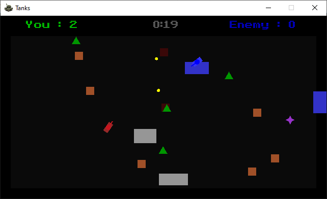
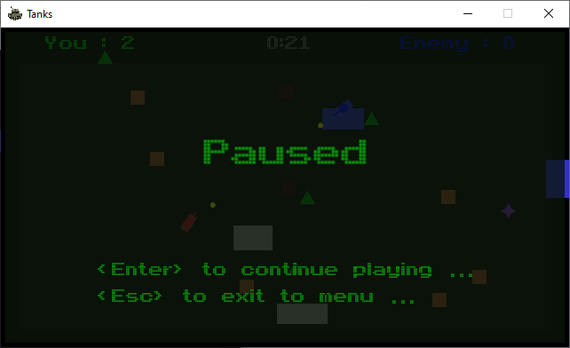

#### My simple tank battle game

It uses handy [sfml](https://www.sfml-dev.org/) library.

The game has different types of entities: your tank, enemy tank, shells, several types of targets.

During a round you should oppose another tank and your goal is just to gain as much points as possible.

With regard of programming some interesting stuff were probed here: 
game states, inheritance, collision detection, obstacles with different properties, timers, embedded files (fonts, pictures, sounds), toggling full screen mode, random map generation.

Feel free to improve the game. There are so many ways to do it:
- game logic,
- add more entities,
- add more precise collisions and events,
- add more sounds with spatialization,
- add textures and animation,
- improve ai behavior strategy of the enemy,
and of course,
- network game.

**Game** | **Screenshots**
:-------------------------:|:-------------------------:
 | 
 | 
 | 
 | 

